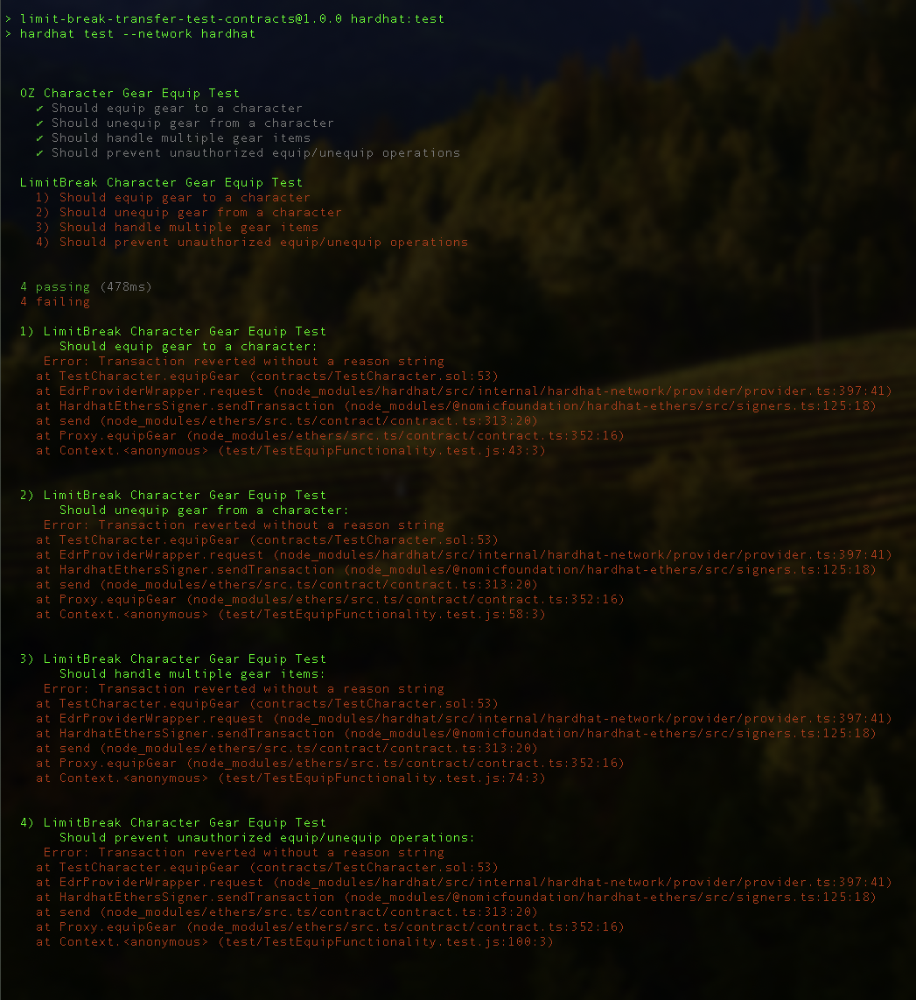

# LimitBreak Contract Transfer Test

This repository contains a test implementation comparing standard OpenZeppelin NFT contracts with LimitBreak's Creator Token Standards. The focus is on testing gear equipping functionality where ERC1155 tokens (gear) can be equipped to ERC721 tokens (characters).

## Implementations

1. **LimitBreak Implementation**:

    - `TestCharacter.sol` - Uses ERC721C from LimitBreak
    - `TestGear.sol` - Uses ERC1155C from LimitBreak

2. **OpenZeppelin Implementation**:
    - `OZTestCharacter.sol` - Uses standard ERC721 from OpenZeppelin
    - `OZTestGear.sol` - Uses standard ERC1155 from OpenZeppelin

Both implementations have identical functionality for equipping/unequipping gear to characters.

## Installation

```bash
# Clone the repository
git clone https://github.com/MirrorWare-io/limit-break-test-contracts
cd limit-break-test-contracts

# Install dependencies
npm install
```

## Running Tests

```bash
# Run tests (this also compiles the contracts)
npm run hardhat:test
```

## Example Test Output


